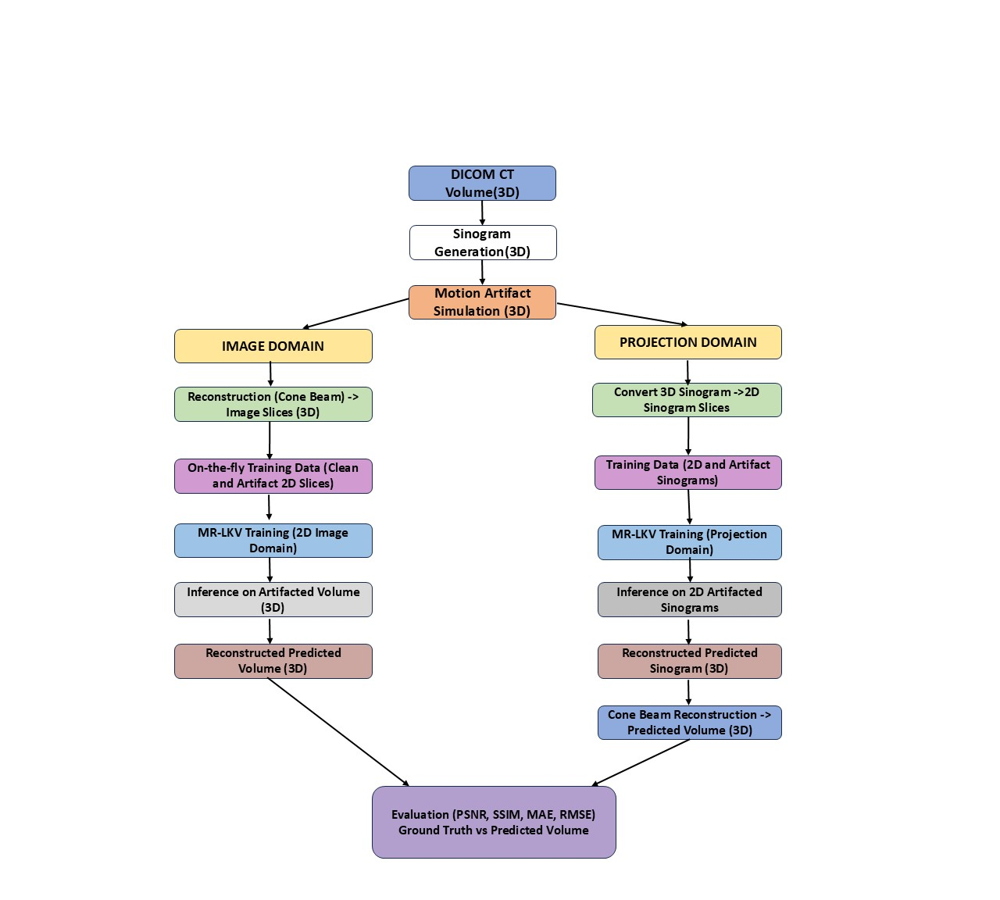
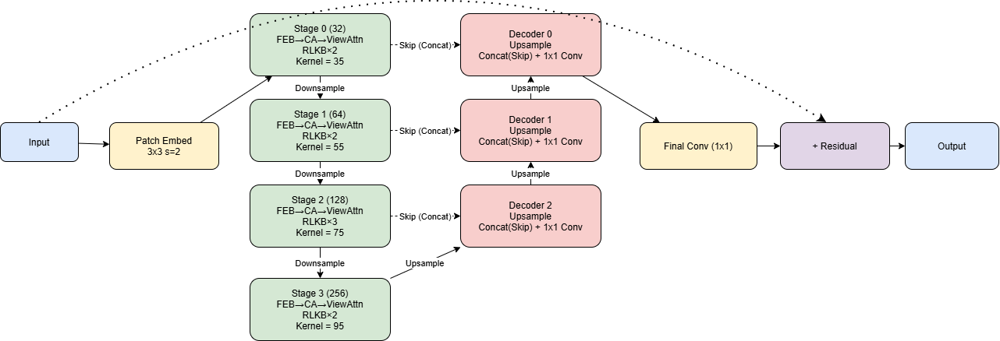

# Motion Artifact Reduction in CT using Super-Large Kernel CNNs (MR-LKV)

## Overview

Motion artifacts in Computed Tomography (CT) scans significantly degrade image quality and affect clinical diagnosis. These artifacts arise due to inconsistencies in projection data caused by patient motion and often exhibit global spatial patterns.

This project proposes a deep learning framework based on **super-large kernel convolutional networks (MR-LKV)** to effectively model and reduce motion artifacts. The approach is implemented and evaluated in both the **projection domain (sinogram space)** and the **image domain (reconstructed CT images)**.

## Objectives

- Develop a deep learning pipeline for motion artifact reduction
- Compare multiple models: MR-LKV (proposed), U-Net, RepLKNet, SwinIR, and Restormer
- Evaluate performance in projection and image domains
- Analyze trade-offs between accuracy (PSNR, SSIM), computational complexity, and inference time

## Repository Structure

```
.
├── src/
│   ├── config/                    # Configuration (paths, hyperparameters)
│   ├── models/                    # MR-LKV, U-Net, RepLKNet
│   ├── image_domain/              # Image-domain training & inference
│   ├── projection_domain/         # Projection-domain pipeline
│   └── ExternalRepo/
│       ├── Restormer/             # Submodule
│       ├── SwinIR/                # Submodule
│       └── diffct/                # Locally modified version
├── checkpoints/                   # Model weights (.pth)
├── evaluation/                       # Plots, logs, reconstructions
├── job.sh                         # HPC job script
├── setup.py
├── requirements.txt
└── README.md
```

## Installation

### 1. Clone the repository

```bash
git clone https://github.com/DEBANJANAB991/Effectiveness-of-Super-Large-Kernel-CNN-for-Motion-Artifact-Reduction.git

```

### 2. Create environment

```bash
conda create -n thesis-gpu python=3.10
conda activate thesis-gpu
```

### 3. Install dependencies

```bash
pip install -r requirements.txt
```

Or install in editable mode:

```bash
pip install -e .
```

## Dataset

- **Dataset:** [CQ500 CT dataset](http://headctstudy.qure.ai/dataset)
- **Preprocessing includes:** DICOM loading, conversion to sinograms, and synthetic motion artifact generation.

> **Note:** The dataset is not included in this repository due to size and privacy constraints.

## Input and Output

- Input:
  - DICOM CT scans or sinograms with motion artifacts

- Output:
  - Artifact-reduced CT images

## Pipeline Overview

### 1. Preprocessing

- Convert DICOM to sinogram
- Add synthetic motion artifacts

### 2. Projection Domain

- Train model on sinograms
- Reconstruct using FDK
- Convert 2D to 3D

### 3. Image Domain

- Train model on reconstructed images
- Perform artifact correction

### 4. Evaluation

- Metrics: PSNR, SSIM
- Visual comparison
- ROI-based analysis
  
<p align="center">
  

## Models

### Proposed Model

- **MR-LKV** — Motion Restoration using Super-Large-Kernel conVolution

#### Network Architecture

<p align="center">
  

### Baselines

- U-Net
- RepLKNet
- SwinIR
- Restormer

### External Models

- [Restormer](https://github.com/swz30/Restormer)
- [SwinIR](https://github.com/JingyunLiang/SwinIR)

### DiffCT (Modified)

This project includes a locally modified version of [DiffCT](https://github.com/sypsyp97/diffct), adapted for pipeline integration, custom preprocessing, and projection handling.

## Training Details

- Loss function: (e.g., L1 / MSE)
- Optimizer: Adam
- Learning rate: 1e-4 (varies per model)
- Hardware: HPC GPU environment

## Evaluation Metrics

- PSNR: Measures reconstruction fidelity
- SSIM: Measures structural similarity
- RMSE / MAE: Pixel-wise error
- LPIPS: Perceptual similarity
## Usage

### Image Domain Training

```bash
python3 src/image_domain/training/train.py
```

### Projection Domain Training

```bash
python3 src/projection_domain/training/train.py
```

### Image Domain Inference

```bash
python3 src/image_domain/inference/run_inference.py
```
### Projection Domain Inference

```bash
python3 src/projection_domain/inference/run_inference.py
```
##  Training and Evaluation

Training and testing instructions are provided in their respective directories.  
The table below provides quick access:

| Task                     | Full Pipeline Instructions | Results |
|--------------------------|---------------------|---------------------|
| Image Domain (MR-LKV)    | [Link](src/image_domain/Readme.md) | [Open](evaluation/qualitative%20analysis/image_domain) |
| Projection Domain (MR-LKV) | [Link](src/projection_domain/Readme.md) |  [Open](evaluation/qualitative%20analysis/projection_domain) |

## Quantitative and Computational Results

### Projection Domain Results

#### Quantitative Comparison

| Model        | PSNR ↑        | SSIM ↑        | VIF ↑         | RMSE ↓        | MAE ↓         | LPIPS ↓       |
|-------------|--------------|--------------|--------------|--------------|--------------|--------------|
| U-Net       | 34.89 ± 10.44 | 0.8664 ± 0.0606 | 0.3128 ± 0.0954 | 0.03840 ± 0.01320 | 0.01612 ± 0.01031 | 0.1400 ± 0.0619 |
| SwinIR      | 34.40 ± 11.25 | 0.8625 ± 0.0754 | 0.3898 ± 0.1574 | 0.04070 ± 0.01630 | 0.01682 ± 0.01181 | 0.1139 ± 0.0656 |
| Restormer   | 36.97 ± 10.01 | 0.8991 ± 0.0456 | 0.3725 ± 0.1107 | 0.03315 ± 0.01114 | 0.01322 ± 0.00806 | 0.1101 ± 0.0563 |
| RepLKNet    | 35.33 ± 10.50 | 0.8786 ± 0.0525 | 0.3559 ± 0.1002 | 0.03829 ± 0.01443 | 0.01642 ± 0.01111 | 0.1405 ± 0.0654 |
| **MR-LKV (Proposed)** | **37.94 ± 10.20** | **0.9024 ± 0.0474** | **0.3880 ± 0.1279** | **0.03097 ± 0.01193** | **0.01234 ± 0.00781** | **0.1027 ± 0.0515** |

#### Model Efficiency

| Model        | Parameters (M) ↓ | FLOPs (G) ↓ | Inference Time (ms) ↓ |
|-------------|------------------|-------------|-----------------------|
| U-Net       | 7.76             | 177.55      | 6.09              |
| SwinIR      | **1.04**         | 860.52      | 2514.62               |
| Restormer   | 10.66            | 756.80      | 227.13                |
| RepLKNet    | 2.73             | 195.29      | 193.40                |
| **MR-LKV (Proposed)** | **8.06**             | **91.24**   | **60.21**                |

### Image Domain Results

#### Quantitative Comparison

| Model        | PSNR (dB) ↑     | SSIM ↑        | VIF ↑         | RMSE ↓        | MAE ↓         | LPIPS ↓       |
|-------------|----------------|--------------|--------------|--------------|--------------|--------------|
| U-Net       | 29.14 ± 7.06   | 0.9002 ± 0.0510 | 0.3668 ± 0.1528 | 0.06183 ± 0.01842 | 0.03315 ± 0.01303 | 0.1059 ± 0.0544 |
| SwinIR      | 29.07 ± 7.22   | 0.8907 ± 0.0604 | 0.3630 ± 0.1250 | 0.06268 ± 0.01789 | 0.03613 ± 0.01308 | 0.1008 ± 0.0576 |
| Restormer   | 29.80 ± 6.93   | 0.9148 ± 0.0427 | 0.3574 ± 0.1458 | 0.05828 ± 0.01940 | 0.02887 ± 0.01153 | 0.0878 ± 0.0447 |
| RepLKNet    | 29.11 ± 7.10   | 0.9002 ± 0.0440 | 0.3222 ± 0.1136 | 0.06156 ± 0.01601 | 0.03133 ± 0.01038 | 0.1090 ± 0.0545 |
| **MR-LKV (Proposed)** | **29.48 ± 6.99**   | **0.8904 ± 0.0556** | **0.3540 ± 0.1250** | **0.05843 ± 0.01546** | **0.03366 ± 0.01202** | **0.1063 ± 0.0568** |

#### Model Efficiency

| Model        | Parameters (M) ↓ | FLOPs (G) ↓ | Inference Time (ms) ↓ |
|-------------|------------------|-------------|-----------------------|
| U-Net       | 7.76             | 109.63      | 7.52              |
| SwinIR      | 1.04         | 175.34      | 236.41                |
| Restormer   | 10.66            | 456.94      | 117.82                |
| RepLKNet    | 2.73             | 118.69      | 105.11                |
| **MR-LKV (Proposed)** | **7.69**             | **53.51**   | **28.66**                |


## Pretrained Models

Pretrained model weights are available here.

### Image Domain

[Image-Domain]( https://drive.google.com/drive/folders/1s54Kxz7kzvkK6pQEev2daEGw6yAZX7_X?usp=sharing)

### Projection Domain

[Projection-Domain](https://drive.google.com/drive/folders/1un4rHg42g8VVwGFvoAxTtyeK8QIHMHTD?usp=sharing)


### Usage

Download the files and place them in `checkpoints/ folder`.


Then update paths in `src/config/config.py`

## HPC Usage

Submit the job script on your cluster:

```bash
sbatch job.sh
```

## Reproducibility Note

This project was developed and executed on an HPC environment. As a result, file paths in `config.py` are specific to the HPC system, datasets are not included, and some scripts expect preprocessed data and directory structures to already be in place.

**To run this project, users need to:**

1. Update paths in `src/config/config.py` to match your local or cluster environment.
2. Provide the CT dataset (e.g., CQ500) and preprocessed sinograms, or regenerate them using the provided preprocessing scripts.

  ```bash
python src/image_domain/preprocessing/dicom_to_sinogram.py
python src/projection_domain/preprocessing/dicom_to_sinogram.py
python src/image_domain/preprocessing/add_motion_artifacts.py
python src/projection_domain/preprocessing/add_motion_artifacts.py

```
3. Adjust checkpoint paths and output directories as needed.

The codebase is structured for clarity and research reproducibility, but requires environment-specific adaptation to run end-to-end.

## Key Contributions

- Introduced MR-LKV for global artifact modeling using super-large kernel convolutions
- Demonstrated effectiveness of super-large-kernel CNNs for CT artifact reduction
- Compared projection-domain vs. image-domain learning strategies
- Built a reproducible end-to-end CT artifact reduction pipeline


## Author

**Debanjona Bhattacharjya**
Master's Thesis — Germany

## Contact

> debanjona.b.bhattacharjya@fau.de
